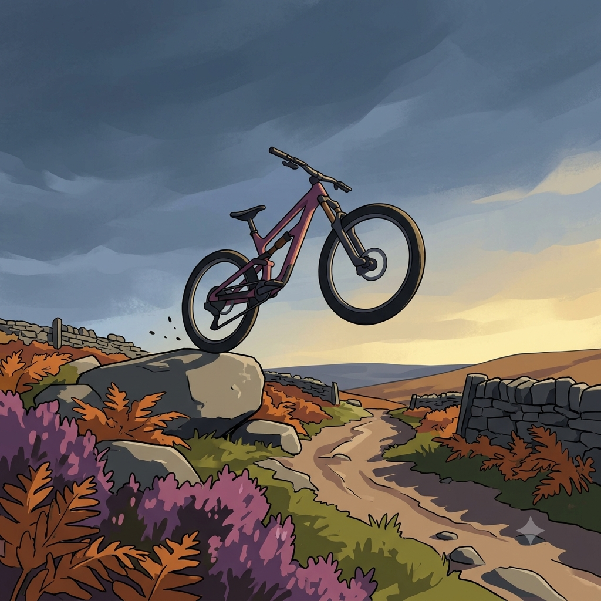
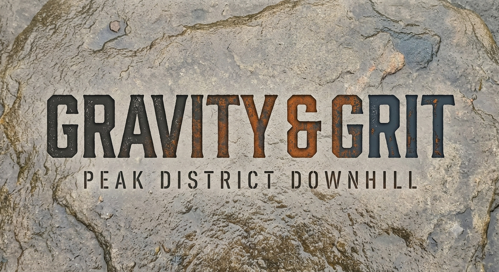
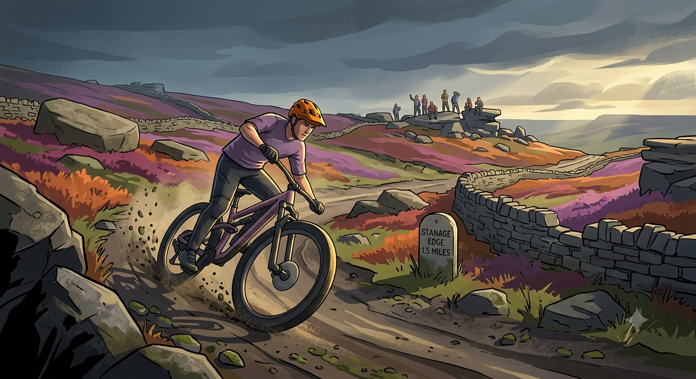
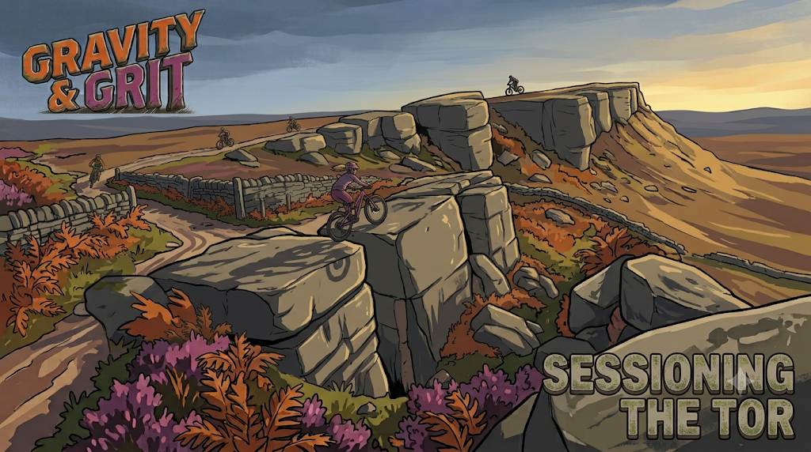
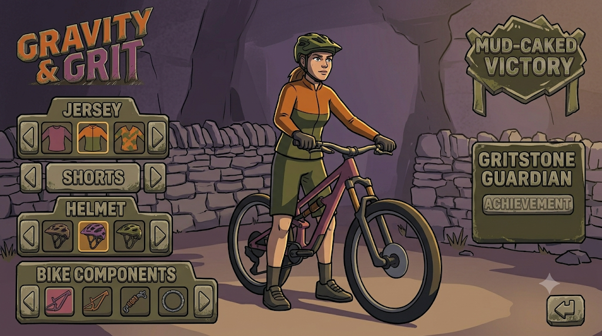

# Gravity & Grit — concept art prompts

Working title from issue #28: **Gravity & Grit**, with our two riders named after
the title — **Gravity** (female) and **Grit** (male). This doc collects ready-to-paste
prompts for Gemini "Nano Banana" (Gemini 2.5 Flash Image) to generate a first pass of
concept art: logo/title treatments, character sheets, environment/loading screens, key
art, and UI icons.

These are a starting point for exploration, not a locked spec — regenerate, remix, and
crop freely. Nothing here is committed as final game art; treat outputs as concept
sketches to react to.

A first pass of generated art from these prompts is saved under
[`images/concept-art/`](images/concept-art/) — see
[`style-guide.md`](style-guide.md) for the resulting colour palette, logo usage rules,
and how these images map onto the itch.io store page.

## How to keep everything looking like one game

Nano Banana is conversational and supports feeding an image back in as a reference, so
lean on that for consistency rather than re-describing the style from scratch every time:

1. **Generate the style anchor first** (prompt 0 below) and keep that image around.
2. For every later prompt, attach the anchor image (and, once made, the relevant
   character sheet) alongside the text prompt and say *"in this exact art style"* /
   *"same character, same outfit"* — Nano Banana is good at holding a consistent
   character and palette across generations when you give it a reference image instead
   of only text.
3. Iterate conversationally on a single image ("make the sky stormier", "give Grit a
   scar on his eyebrow") instead of writing a brand new prompt each time — edits stay
   more consistent than fresh generations.
4. Reuse the **art direction paragraph** verbatim (or nearly so) at the start of every
   prompt below — it's the shared DNA that keeps title art, characters, and
   environments feeling like the same game.
5. Generate roughly in this order so later prompts can reference earlier images: style
   anchor → characters → environments → key art / loading screens → UI/icons.

## Art direction paragraph (reuse this in every prompt)

> Stylized 3D-rendered illustration, somewhere between a modern arcade sports game
> (Tony Hawk's Pro Skater, SSX) and a British countryside travel poster: bold graphic
> shapes, clean cel-shaded lighting with soft ambient occlusion, chunky simplified
> forms rather than photoreal detail, subtle painterly texture in the skies and
> foliage. Colour palette: heather purple and burnt-heather magenta, gritstone grey and
> charcoal, bracken orange and moss green, overcast slate-blue sky breaking to warm gold
> at the horizon. Lighting is low, raking, late-afternoon Peak District sun — long
> shadows, dramatic rim light, moody clouds. Setting is real Yorkshire/Derbyshire
> gritstone moorland: dry-stone walls, heather and bracken, weathered millstone-grit
> boulders and edges, rutted bridleways. Overall mood: gritty, weather-beaten,
> adrenaline-charged, a little wind-blown chaos — not cute, not cartoonish-soft.

### 0. Style anchor

```
Generate a single square concept-art tile that establishes an art style: a lone
mountain bike mid-jump off a gritstone boulder on a moorland bridleway, silhouetted
against a stormy slate-blue sky breaking to gold at the horizon. [Paste the art
direction paragraph above.] No text, no logo — this is a pure style reference for
palette, linework, and lighting to reuse in later images.
```



## 1. Title / logo art

### 1a. Primary logo lockup

```
[Art direction paragraph.] Design a game logo reading "GRAVITY & GRIT" in a bold,
chunky, slightly weathered display typeface — as if the letterforms were carved from
gritstone and lichen-stained at the edges, with a scratched, dirt-sprayed texture along
the baseline. "GRAVITY" sits above "& GRIT" (or the two words stack diagonally,
following a downhill slope) so the whole lockup reads like it's tipping downhill. Work
the palette's bracken-orange and heather-purple into the letters, gritstone grey for
depth/bevels. Background transparent or a simple dark gradient so the logo reads as a
standalone asset.
```



An alternate illustrated woodcut-badge treatment was also generated as a reference
option — see `images/concept-art/logo-lockup-woodcut-badge.jpeg`. For compositing the
wordmark over other art (as in the two lockups above, or `og-image.png`), use
`images/concept-art/logo-mark-transparent.png`, which has a real alpha channel.

### 1b. Subtitle lockup variant

```
Same brief as above, but add a smaller descriptive subtitle line beneath the main
logo reading "PEAK DISTRICT DOWNHILL" in a plainer, narrower condensed sans-serif,
sitting quietly under the bold "GRAVITY & GRIT" wordmark — the subtitle should feel
like a stencil-sprayed trail waymarker, not compete with the main logo.
```

### 1c. Title screen composition

```
[Art direction paragraph.] Full title-screen key art, portrait or landscape. In the
foreground, Gravity and Grit ride side by side down a gritstone bridleway with heather
either side, caught mid-action (one popping a small jump, dust and grit kicked up
behind their tyres). Behind them, a sweeping Peak District valley falls away into mist,
dry-stone-walled fields in the middle distance, a stormy sky breaking to gold above the
horizon. Leave clear negative space in the upper third of the frame for the "GRAVITY &
GRIT" logo to sit over the sky.
```

## 2. Character concept art

### 2a. Gravity — character turnaround

```
[Art direction paragraph.] Full-body character concept sheet for "Gravity", a female
downhill mountain biker in her mid-20s, confident and a little reckless. Three poses in
a row on a neutral background: front view, side view, back view, standing beside her
bike in full-face helmet under one arm (helmet off so her face is visible), riding
gear: fitted enduro jersey in heather-purple and charcoal with a small gritstone-grey
& bracken-orange stripe, padded shorts over leggings, knee pads, flat-pedal shoes.
Windswept dark hair, a few scuffs and mud spatter on the kit from past crashes,
confident half-smile. Bike is a modern full-suspension trail bike, mud-flecked, in
matching purple/grey team colours.
```

### 2b. Grit — character turnaround

```
[Art direction paragraph.] Full-body character concept sheet for "Grit", a male
downhill mountain biker in his late 20s, stocky, weathered, grinning like he enjoys the
crashes as much as the runs. Three poses in a row on a neutral background: front view,
side view, back view, standing beside his bike with a full-face helmet under one arm.
Riding gear: looser-fit enduro jersey in bracken-orange and charcoal with a
gritstone-grey & heather-purple stripe (same team palette as Gravity, inverted
emphasis), armoured shorts, elbow pads, scuffed flat-pedal shoes. Short beard, a
scar through one eyebrow, mud and gravel rash visible on his forearms. Bike is a
burlier hardtail/enduro build in matching orange/grey team colours.
```

### 2c. Duo action shot

```
[Art direction paragraph.] Gravity and Grit riding a rocky Peak District bridleway
together, elbow to elbow, mid-descent — Gravity slightly ahead popping off a gritstone
ledge, Grit behind leaning into a berm with his rear wheel kicking up dust and loose
grit. Dry-stone wall and heather moorland either side, dramatic low sun behind them.
Dynamic low-angle "trading card" composition, plenty of motion blur on the wheels and
grit spray, otherwise sharp on the riders' faces and kit.
```

### 2d. Expression / emote sheet (for UI portraits)

```
[Art direction paragraph.] A grid of 6 small head-and-shoulders portraits of Gravity
and Grit (3 each) showing different in-game reaction expressions: confident smirk,
mid-air "sending it" grin, wincing after a crash, victorious fist-pump laugh,
determined focus at the start gate, dazed-but-okay after a tumble (mud on face,
helmet slightly askew). Consistent lighting and palette across all six so they can be
used as matching HUD portrait icons.
```

## 3. Environment & loading-screen art

### 3a. Cut Gate descent vista

```
[Art direction paragraph.] Wide landscape concept art of the Cut Gate bridleway
descent: a rocky, rutted trail dropping away through open moorland, heather and
bracken either side, gritstone outcrops breaking through the peat, a dry-stone wall
following the trail into the distance, low cloud clinging to the tops of the hills, a
shaft of late-afternoon sun breaking through onto the valley floor below. No riders —
this is a pure environment/loading-screen background with room for a HUD or tip text
to sit over the darker sky area.
```

### 3b. Gritstone edge / tor

```
[Art direction paragraph.] A dramatic weathered millstone-grit outcrop (in the style
of a Peak District edge like Stanage or Kinder) rising above a bridleway, boulders
stacked and wind-carved, heather growing in the cracks, a distant view over a
patchwork of dry-stone-walled fields and a reservoir far below. Stormy sky, dramatic
rim light along the rock edges. Loading-screen composition — foreground rock detail
sharp, background soft and atmospheric.
```



Note this particular generation includes a real "STANAGE EDGE 1.5 MILES" waymarker —
useful as generic gritstone-edge atmosphere, but the game only models Cut Gate so far,
so don't use this one anywhere it could read as a claim about in-game locations.

### 3c. Dry-stone wall & bridleway close-up

```
[Art direction paragraph.] A ground-level, close-up environment study: a rutted,
puddled bridleway running alongside a dry-stone wall, loose gritstone scree and
exposed roots across the trail surface, tufts of heather and bracken, a wooden
bridleway waymarker post leaning slightly. Late afternoon side-light raking across the
texture of the stones and mud. No characters — a texture/mood reference plate for
trail surfaces and dressing.
```

### 3d. Storm-light moorland (game-over / pause screen mood)

```
[Art direction paragraph.] A darker, moodier variant of the moorland landscape for a
game-over or pause screen: heavy slate-grey storm clouds rolling over open moorland,
a single distant gritstone tor lit by a thin break of gold light on the horizon, an
abandoned-looking dry-stone sheepfold in the middle distance. Quieter, more subdued
composition than the main menu art — same palette, lower energy.
```

## 4. Key art / full-screen splash art

### 4a. Main menu key art

```
[Art direction paragraph.] Full-scene key art for the main menu: Gravity and Grit at
the top of the Cut Gate descent, bikes angled downhill, looking out over the valley
below before dropping in. Golden late-afternoon light, dramatic sky, heather and
gritstone framing the shot. Leave open sky/negative space in the upper portion for
menu buttons to overlay.
```



### 4b. Crash / game-over screen

```
[Art direction paragraph, darker/muted variant.] Gravity (or Grit, generate both as
alternates) sitting on the ground beside a toppled bike after a crash, muddy and
scuffed but laughing it off, helmet off, on a rocky bridleway with heather around
them. Overcast light, softer and less dramatic than the title art, communicating "try
again" rather than failure or danger.
```

### 4c. Finish-line / victory screen

```
[Art direction paragraph.] Gravity and Grit at the bottom of the descent, arriving at
a stone bridge or gate at the edge of a Peak District village, dismounting or
fist-bumping, bikes muddy and travel-worn, warm low sun behind them, a hint of
patchwork farmland and a village in the soft-focus background. Triumphant but grounded
mood — dusty and tired, not glossy.
```

## 5. UI & iconography

### 5a. Trick / combo icon set

```
[Art direction paragraph, simplified for small-scale icons: bolder shapes, less
texture, flat cel-shading, thick dark outlines so these read at 64px.] A set of 8
square icon tiles for mountain-bike trick/combo moves — bar spin, tail whip, manual,
bunny hop, drop, backflip, no-hander, wheelie — each shown as a simple silhouetted
rider-on-bike icon mid-trick, heather-purple/bracken-orange/gritstone-grey palette,
consistent icon-frame composition (rider centred, trick readable from silhouette
alone).
```

### 5b. HUD badges / medals

```
[Art direction paragraph, simplified/flat for small UI use.] A set of 3 circular medal
badges (bronze/silver/gold equivalents reimagined as gritstone/heather/gold-light
tiers) for run completion ranks, each with a small embossed bike-wheel or gritstone
motif in the centre, weathered stone-carved look with a subtle metallic rim.
```



The above wasn't generated from an exact prompt in this doc — it's an exploratory UI
concept combining a kit-customisation screen with achievement-badge styling ("Mud-Caked
Victory", "Gritstone Guardian"), kept here as a reference for badge/medal treatment and
general HUD panel styling (weathered stone-tablet buttons, parchment-on-charcoal text).

### 5c. App icon / favicon

```
[Art direction paragraph, bold and simplified for a small square icon, thick outlines,
high contrast, readable at 32px.] A single square app-icon composition: a stylised
side-on silhouette of a mountain bike mid-jump off a gritstone ledge, heather-purple
sky background fading to bracken-orange at the bottom, no text, no character detail —
just a strong graphic silhouette that reads instantly at small sizes.
```

## 6. Marketing assets

### 6a. Wide social / store banner

```
[Art direction paragraph.] Wide 16:9 banner composition combining the "GRAVITY & GRIT"
logo (upper-left third) over the title-screen vista from prompt 1c, Gravity and Grit
riding through the lower-right two-thirds of the frame. Leave clean sky space around
the logo so it stays legible when the banner is cropped for different store/social
aspect ratios.
```

### 6b. Loading-tip background plates

```
[Art direction paragraph, subdued/lower-contrast so overlaid white text stays
readable.] A set of 3 loading-screen background plates using the moorland/gritstone
environment palette but pushed darker and lower-contrast in the centre third of the
frame (where tip text will sit), keeping detail and colour richer at the edges: (1) a
misty valley view, (2) a close-up of a heather-lined bridleway, (3) a gritstone edge
silhouette at dusk.
```
